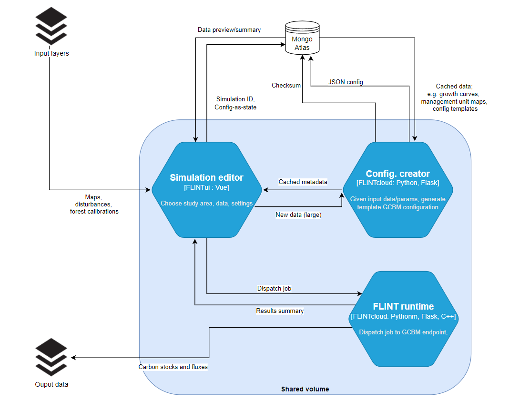

# Google Summer of Code 2022 Ideas

## About moja global

Help fight climate change from your keyboard! [Moja global](https://moja.global) provides tools for estimating emissions and removals of greenhouse gasses (GHG) from the land sector. The [Full Lands INtegration Tool](https://github.com/moja-global/flint) also known as FLINT, available under MPL-2.0 License, is a platform developed by the moja global team for data collection, analysis and continuous improvement of greenhouse gas inventories related to land use and land-use change at local, national and global scales.

The FLINT is based on over 20 years of experience building and operating measurement, reporting and verification (MRV) tools in Australia and Canada. The FLINT provides the capability to quickly establish an operational MRV system that can respond to policymaking and planning needs. The FLINT has been designed to achieve the required accuracy through step-by-step improvements.

New FLINT users are expected to follow the IPCC guidelines to develop increasingly accurate and robust systems for greenhouse gas accounting. Users are supported by moja global, a vibrant developer community, and philanthropic partners like the UNFCCC and IUCN. We hope to grow the number of institutional users to 14 countries by 2023 and require excellent communication, education and documentation across a wide range of topics including science, policy and software development.

Moja global has hosted mentees from [Google Summer of Code](https://summerofcode.withgoogle.com/), [Google Season of Docs](https://developers.google.com/season-of-docs), [The Linux Foundation](https://mentorship.lfx.linuxfoundation.org/) and [Outreachy internships](https://outreachy.org/). The Mentorship Working Group can put interested applicants in contact with previous mentees and mentors as needed. We aim to be an inclusive community and hold regular meet-ups for moja global's Working Groups. Enthusiasm, generousity and creativity are celebrated and encourage people to join our community to collaborate for change.

Prospective developers should have a look at the [Google Summer of Code website](https://summerofcode.withgoogle.com) and the [Google Summer of Code Student Guide](https://google.github.io/gsocguides/) to learn more about the program. To draft a proposal, use the [Google Summer of Code proposal template](GSOC-STUDENT-TEMPLATE.md) proposed by our community.

## Idea: GCBM Simulation Editor for FLINT-UI

### Abstract

[FLINT-UI](https://github.com/moja-global/flint-ui) provides an intuitive way for new users to explore some preconfigured FLINT modules, including the [Generic Carbon Budget Model (GCBM)](https://community.moja.global/docs/GCBM/GCBM). The FLINT-UI client is written as a web application and can be used in a local or remote environment.

The GCBM is a spatially-explicit forest ecosystem carbon accounting tool. The key advantage of GCBM is the level of detail specified in the IPCC Tier 3 scientific model and FLINT’s ability to run this model over large spatial scales. The FLINT is used to run the GCBM and generate detailed maps of carbon changes and emission associated with land use change.

The project involves the development of a GCBM Simulation Editor for FLINT-UI. We want to facilitate common GCBM analysis tasks and make it easier to configure new GCBM simulations. The configuration generated by a Simulation Editor is saved to GitHub and reproduced in our MLOps pipeline.

| Category              | Rating                                                                                 |
| --------------------- | -------------------------------------------------------------------------------------- |
| Difficulty            | Medium                                                                                 |
| Priority              | High                                                                                   |
| Skills                | VueJS, Flask, Docker                                                                   |
| Project Size          | Large (350 hours)                                                                      |
| Preferred Contributor | Student/Professional                                                                   |
| Mentors               | [@aornugent](https://github.com/aornugent), [@gabalafou](https://github.com/gabalafou) |

### Project goals

In 2021 we began several projects to increase the accessibility of the Full Lands Integration Tool (FLINT) by providing the FLINT-UI project. FLINT-UI is a service or tool that is part of the moja global ecosystem built around FLINT.

Our UI experiment provides a proof of concept and a solid foundation, but interested candidates must be able to reflect on the macro-architecture of the project and take a leadership role in establishing the direction of the project. GCBM configuration is an intimidating task and there is limited prior art to draw from.

A core goal of the FLINT-UI is to make a complex model more accessible. The GCBM can be intimidating and some familiarity with earth system models or computational ecology is encouraged. We can provide a template project (the GCBM Demo Run) to start with, but a great FLINT-UI contributor would understand what these templates represent and develop intuitive ways to modify the simulation.

This project entails:

- Understanding GCBM standalone configuration and workflow runs and mapping a user story for interface.
- Developing a simulation editor on FLINT-UI while adding support for complex workflow runs on FLINT.Cloud.
- Adding user-stories for scientists and researchers to effectively use the feature along with end-to-end testing for FLINT-UI.

### Technical skills

During this project, the developer will be working with the UI working group under the Technical Steering Committee (TSC) on contributing to FLINT-UI while getting hands-on experience on working with VueJS, Flask, Docker and GCBM. Experience with VueJS and JavaScript is preferred. Experience with Flask and Docker would be useful. Understanding of FLINT & GCBM would be preferred but not necessary.

### Resources

- FLINT-UI: https://docs.moja.global/projects/flint-ui/en/latest/
- GCBM: https://docs.moja.global/en/latest/GCBMDevelopmentSetup/index.html
- GitHub Issue: https://github.com/moja-global/FLINT-UI/issues/128

### First steps

Introduce yourself on Slack in the `#user-interface` channel and review the GCBM Demo Run included in the FLINT.Cloud repository. Share a visualisation of the model results and contribute to the existing FLINT-UI issue on the GCBM configuration.

## Idea: MLOps for reproducible science

### Abstract

moja global's community run earth system simulations to track the flow of carbon in the forestry and land sectors. Models are calibrated to account for climate, forest types, disturbances (like fires, or hurricanes and so on) and land-use transitions. We aim to make these simulations trivially reproducible by streamlining the workflow of data scientists that use our software. We provide pre-built containers with versioned code but do not yet apply this process to our data. Members of the [FLINT.Cloud](https://github.com/moja-global/flint.cloud) project aim to add Data version control (DVC) and Continuous machine learning (CML) to our deployment scenario templates.

FLINT.Cloud is a cloud deployment framework for rapid deployment of FLINT implementations and to offer FLINT as a service for demonstration purposes. FLINT.Cloud offers an easy entry point for new users to evaluate the FLINT platform and provide a blueprint for new users to roll their own.

The goal of this project is to streamline the workflow of data scientists on the FLINT.Cloud project by leveraging the combined potential of Data version control (DVC) and Continuous Machine Learning (CML). Data engineers, Machine Learning engineers, and Data science Practitioners work with a wide range of data and they need to have a workflow and tools to support it to keep track of their artifacts and their versions, resolve issues, and collaborate across teams and systems.

This project should demonstrate the functionality of reproducible analysis using Github Actions. Success will be evaluated on the number of new data, models and simulations shared within the community.

| Category              | Rating                                                                                                                                       |
| --------------------- | -------------------------------------------------------------------------------------------------------------------------------------------- |
| Difficulty            | Easy                                                                                                                                         |
| Priority              | Medium                                                                                                                                       |
| Skills                | Docker, Python, DVC, CML, GitHub Actions                                                                                                     |
| Project Size          | Medium (175 hours)                                                                                                                           |
| Preferred Contributor | Student/Professional                                                                                                                         |
| Mentors               | [@aornugent](https://github.com/aornugent), [@asmijafar20](https://github.com/asmijafar20), [@Simpleshell3](https://github.com/Simpleshell3) |

### Project goals

In 2021 we began several projects to increase the accessibility of the Full Lands Integration Tool (FLINT) by providing Docker containers running example models using a simple Flask API and the moja global's FLINT CLI. These pre-built environments provide templates for running common analysis.

moja global also make available open-source land sector datasets for use as inputs into FLINT models. The bottleneck now becomes the calibration of FLINT models to specific data requirements. Using DVC and CML provide a light-weight means to track the specific configuration and calibration of FLINT simulations. 

DVC indexes the input and outputs of model code and automatically updates the model to the latest version when data inputs change. CML is an open-source library that complements this process by integrating DVC into continuous integration pipelines such as Github Actions.

This project entails:

- Integrating reproducible analysis using Github Actions with Data version control (DVC) and Continuous Machine Learning (CML).
- Implementing support for saving the output of the configuration phase to reuse for subsequent builds.
- Enhancing the test suite and user story of FLINT.Cloud with reproducible ​​examples from moja global datasets.

### Technical skills

Experience with Python, GitHub Actions and Data Science is preferable. Understanding of C++ and Docker is useful. Understanding DVC and CML would be preferred but not necessary. An understanding of computational ecology or earth system modelling is useful to verify what model results make for useful summaries, but your mentors can provide appropriate guidance in this area.

### Resources

- DVC: https://dvc.org/
- CML: https://cml.dev/ 
- CML & GHA: https://mlops-guide.github.io/CICD/cml_testing/ 
- FLINT.Cloud: https://github.com/moja-global/FLINT.Cloud

### First steps

Introduce yourself on Slack in the `#cloud` channel. Download the FLINT.Cloud GCBM container and re-create the GCBM Demo Run. Share your findings on Slack under `#cloud`.

## Idea: Improving FLINT.Reporting for general-purpose usage

### Abstract

Moja global community uses FLINT.Reporting to provide Business Intelligence for analyzing and transforming FLINT output databases into useful information and outputs. FLINT.Reporting Tool takes flux facts and assigns/aggregates them to a land-use category, a reporting table and a UNFCCC reporting variable. The Reporting Tool was simply brought together to support the generation of tables, graphs, and other reporting artifacts, from the FLINT output databases, to meet policy and other reporting requirements.

The big picture is that the Reporting Tool takes flux facts and assigns/aggregates them to a land-use category, a reporting table and a UNFCCC reporting variable. The support for these reporting requirements was not envisioned to happen all at once; but rather in a piece by piece manner, with the first version of the Reporting Tool (the current version) supporting the generation of UNFCCC CRF tables. 

The project will involve improving the FLINT.Reporting and ready for our users to extract actionable business intelligence from the FLINT. This project should demonstrate the functionality of FLINT.Reporting to a wider audience by implementing new features, generalizing the reporting process, and improving the analysis for a broader audience. The project would benefit non-technical users like researchers, policy makers, and analysts to better understand FLINT and the overall reporting process.

| Category              | Rating                                         |
| --------------------- | ---------------------------------------------- |
| Difficulty            | Hard                                           |
| Priority              | High                                           |
| Skills                | Spring Boot, Angular, PostgreSQL, Docker, BASH |
| Project Size          | Large (350 hours)                              |
| Preferred Contributor | Student/Professional                           |
| Mentors               | [@tonnix](https://github.com/Tonnix)           |

### Project goals

FLINT.Reporting was built to facilitate the processing of Flux database UNFCCC National Inventory as part of National Communications and Biennial Update Reporting. The reporting structure was designed & implemented under the 2006 IPCC Guidelines as a requirement of the enhanced transparency framework. In 2021, the FLINT.Reporting tool was re-designed and implemented with the support for the generation of UNFCCC CRF tables. Future versions are envisioned to support REDD+ reporting and other reporting requirements.

This project entails:

- Developing the administrative unit of the FLINT.Reporting to be as generic as possible. Currently it is based on the Kenyan Administrative Unit Structure since the reference was Kenyan-based.
- Improve FLINT.Reporting to share the same PostgreSQL database with the FLINT to avoid re-importation issues or redesign it to have its own PostgreSQL database to allow successful importation of dumped data.
- Build an interface for onboarding data to make it easier for non technical users to operate the system. The FLINT output data is currently loaded into the Reporting Tool’s PostgreSQL database via a script which kick-starts the aggregation exercise.
- Expose the FLINT.Reporting configuration to allow future users to tweak them to their country requirements. The Reporting Tool Report Parameters were fixed based on Kenyan policies.

### Technical skills

During this project, the developer will be working with the Technical Steering Committee (TSC) on contributing to FLINT.Reporting while getting hands-on experience with Spring Boot, Angular, PostgreSQL, Docker while understanding FLINT.Reporting in depth. Experience with Spring Boot and PostgreSQL is preferred. Experience with Angular and Docker would be useful. Understanding of FLINT would be preferred but not necessary.

### Resources

- FLINT.Reporting: ​​https://docs.moja.global/projects/flint-reporting/en/latest/index.html

### First steps

Get FLINT.Reporting up and running on your local machine by following the docs and understand the various microservices and software components. After setup and initial discovery, share your findings on `#reporting-tool` channel.

## Idea: Building UI library for moja global

### Abstract

Moja global community currently maintains four User-interface (UI) projects, all of which follow a vastly different design pattern, user-interface style and approach. It has led to specific inconsistencies and gaps in the UI design and development process, which is a major roadblock for the community looking to start the work on new UI-based projects.

Moja global User-interface (UI) library aims to bring forward an intuitive, consistent, and easy-to-use interface that can help our developers within the User-Interface working group and users to quickly accomplish their tasks. The UI library would aim to considerably improve our design & development workflow and meet the acceptable web accessibility requirements for our potential users. A UI library would help us mitigate popular UI-development issues like inconsistent user-experience, performance issues, accessibility requirements and more. 

The aim of this project is to build a unified and consistent design language to help our contributors and users. To achieve this, a centralized collection of components would be developed which will encompass the color branding of moja global, typography, spacing, buttons, modals and forms. The big picture is that the UI library will allow all the upcoming moja global projects, with a client-facing focus, to have a consistent design language that will help us to quickly and easily build their user-interface.

| Category              | Rating                                                                                                                                                 |
| --------------------- | ------------------------------------------------------------------------------------------------------------------------------------------------------ |
| Difficulty            | Medium                                                                                                                                                 |
| Priority              | Low                                                                                                                                                    |
| Skills                | JavaScript/TypeScript, UI/UX, Design Systems                                                                                                           |
| Project Size          | Medium (175 hours)                                                                                                                                     |
| Preferred Contributor | Student/Professional                                                                                                                                   |
| Mentors               | [Gopinath Balakrishnan](https://www.linkedin.com/in/bgopi), [@gabalafou](https://github.com/gabalafou), [@HarshCasper](https://github.com/harshcasper) |

### Project goals

In 2021 we began several projects to increase the accessibility of the Full Lands Integration Tool (FLINT) by providing including the FLINT-UI project. FLINT-UI is a service or tool that is part of the moja global ecosystem built around FLINT.

An interesting outcome of the project was the development of multiple reusable components that can be used by other UI-specific projects within moja global. We are expecting contributors to build on that experience and develop a full-fledged UI library for moja global that will help represent the branding of moja global in the wider open-source community.

This project entails:

- Study existing User-interface (UI) projects at moja global and sketch out components to be designed and developed.
- Move/update all React and Vue pages to the design system while making sure they meet the standards.
- Design & develop the components while building clear standards on how the components would be utilized across moja global projects.
- Package the UI library as a stand-alone dependency to be used seamlessly with grace.

### Technical skills

During this project, the developer will be working with multiple stakeholders across various working groups under the Technical Steering Committee (TSC) on various aspects of engineering: design, development, testing and packaging. Experience with JavaScript/TypeScript, Design systems, UI/UX is preferable. Understanding of moja global projects like FLINT-UI, Community Website, FLINT.Reporting is useful.

### Resources

- Design Systems: https://www.designsystems.com/
- FLINT-UI: https://github.com/moja-global/FLINT-UI
- FLINT.Reporting: https://github.com/moja-global/FLINT.Reporting
- Community Website: https://github.com/moja-global/community-website 
- Moja global branding: https://community.moja.global/docs/moja-global-branding

### First steps

Study the UI-projects at moja global, and create a list of components that can be used across the moja global ecosystem. Share your findings on the `#user-interface` channel.

## Idea: Packaging FLINT for cross-platform usage 

### Abstract

FLINT is an open source, modular tool that estimates greenhouse gas (GHG) emissions from land by modeling the flux of GHG on millions (or even billions) of land parcels. Moja global community currently relies on FLINT as an integrating platform for estimating land-based greenhouse gas emissions and removals. FLINT is also used as the base framework for various projects under the moja global umbrella including FLINT.Cloud, GCBM and other projects. The basic role of the FLINT is to coordinate the interaction of data (e.g. spatial data, non-spatial data, carbon pools, variables, fluxes) and modules. As a full-mass balance framework, FLINT meets all IPCC requirements and allows progressive development of MRV-related systems, data and capacities.

Currently building FLINT locally is a challenging and a time-consuming process. The development build of FLINT has been made possible only on Windows while Docker images are available for Linux-based distributions and macOS. The project idea is to package FLINT and make the packages available across major operating systems and architectures. These packages would be made available on the FLINT repository (as part of the release) and/or on the moja global community website for users to install and get started with. It would allow the moja global community to demonstrate the cross-platform usage of FLINT and help simplify the workflow for contributors and general users.

The project would also entail the development of a standard release process for the FLINT. It would involve communicating with stakeholders across the moja global community, technical skills to triage FLINT and other moja global projects and work with the maintainers to bring them into line with the DevOps working group best practices. The release process would facilitate timely release of various projects and the community to be able to use the packages.

| Category              | Rating                                         |
| --------------------- | ---------------------------------------------- |
| Difficulty            | Medium                                         |
| Priority              | High                                           |
| Skills                | C++, BASH, Batch, GitHub Actions, CMake        |
| Project Size          | Large (350 hours)                              |
| Preferred Contributor | Student/Professional                           |
| Mentors               | [@HarshCasper](https://github.com/harshcasper) |

### Project goals

This project entails:

- Understanding FLINT, moja libraries and the build process involved and sketching a release process for the Technical Steering Committee (TSC).
- Implementing build scripts for various operating systems and architectures to build distributable packages for FLINT.
- Integrating GitHub Actions to package the FLINT and creating a test strategy to facilitate before general usage. 
- Development of a release process to facilitate the release of the packages across the moja global community.

### Technical skills

During this project, the developer will be working with the DevOps working group under the Technical Steering Committee (TSC) on packaging FLINT and will get hands-on experience on working with C++, CMake build systems, writing CI/CD pipelines and initiating a release process for moja global. Experience with C++, CMake and GitHub Actions is preferred. Understanding of FLINT, packaging would be preferred but not necessary.

### Resources

- CMake: https://cmake.org/
- Understanding FLINT: https://docs.moja.global/en/latest/Understanding-FLINT
- Compiler Cache: https://ccache.dev/
- Packaging with GitHub Actions: https://docs.github.com/en/actions/publishing-packages/

Moja global teams also have development specific draft guides for understanding the technical intricacies of building FLINT along with the base packages. The guides are available here:

- [Moja base libraries](https://docs.google.com/document/d/1i6S0X0nTyxfJwn6KhGo9AahXOH1gBnTdwYdAxGchHsI/edit?usp=sharing)
- [Moja FLINT library](https://docs.google.com/document/d/1jceIX1E7HOmzmLW6C-E6GDbMz9sxM-nIy90CbY463Lw/edit?usp=sharing)
- [Moja FLINT implementation](https://docs.google.com/document/d/139-1Nc5AR0yhN--Jb0W_jIfzUasoItkt4dyYM3m19N4/edit?usp=sharing)

### First steps

Study the FLINT and follow our [FLINT Developer tutorial](https://www.youtube.com/playlist?list=PL_WECUlMWiUkyx5ohT2jglPSa58XmOhgY) and [FLINT Development setup docs](https://docs.moja.global/en/latest/DevelopmentSetup/index.html) to get started. Formulate a release process plan and share your findings with the DevOps and working group on the `#devops` channel.

## Idea: Developing a FLINT Forest Monitoring tool using Land Sector datasets

### Abstract

Interested in how forests help us store carbon? We are embarking on a pilot project to monitor the effect of forest management practices around the world. We hope this work can support forest owners, stakeholders and policymakers. Using various forest management indicators and a representative sample of ecosystem and climatic conditions, we aim to develop an open source workflow for the assessment of ecological conditions in forests around the world.

Our project involves finding 100+ small squares of forest from around the world and cross referencing these locations freely available land sector datasets. Mentees will work with the moja global DevOps Working Group to develop and document a FLINT-based proof-of-concept. The goal of this project is to run a unique FLINT simulation of forest dynamics for each location but these simulations will be developed by a cohort of community members of which you will be a part. You'll be responsible for helping set up a scalable and repeatable system for running these simulations, storing and sharing each of the results in a NoSQL Database (MongoDB). The DevOps working group have templates for local and cloud-based deployment of FLINT and it's associated models that you can use. 

| Category              | Rating                                                                                     |
| --------------------- | ------------------------------------------------------------------------------------------ |
| Difficulty            | Medium                                                                                     |
| Priority              | High                                                                                       |
| Skills                | Python, MongoDB, CI/CD, Data Science                                                       |
| Project Size          | Medium (175 hours)                                                                         |
| Preferred Contributor | Student/Professional                                                                       |
| Mentors               | [@aornugent](https://github.com/aornugent), [@HarshCasper](https://github.com/harshcasper) |

### Project Goals

FLINT.cloud provides a number of templates for container-based deployment of FLINT a Flask-based API. We have successfully implemented the Generic Carbon Budget Model that describes forest dynamics of large landscapes. We wish to demontsrate this capability by running many, smaller examples across a wide range of ecosystem types and climate conditions. 

Generating the model configuration still remains a manual (and often tedious job). GSoC mentees will be required to develop semi-automated configuration generation and data QA as part of this project. Once a simple workflow has been established, the success of our project will be determined by our ability to easily create, track and compare the results of many small simulations at once. A stretch goal is to document a meta-learning protocol for optimising the configuration for each simulation, as well as the consistency and accuracy of the simulation ensemble.

This project entails:

- Study the Land Sector datasets and sketch out a data workflow to intelligently identify small squares of forest from around the world.
- Development of a Python-based tool produce GCBM configurations for the identified squares and dispatch simulations using the FLINT.Cloud templates
- Integrate a CI/CD-based workflow to push generated results to a remote MongoDB Atlas instance while applying rules-based projections.
- Document the results on public moja global documentation and offer a template to users who are looking to try the above.

### Technical Skills

During this project, the you will be working with the moja global DevOps Working Group on developing and deploying a pre-processing new tool. This will require getting hands-on experience with Python, MongoDB, CI/CD while implementing data science and analysis methodologies. Experience with Python and MongoDB is preferred. Experience with Docker and CI/CD would be useful. Understanding of FLINT, carbon modelling and the moja global ecosystem will be helpful but not necessary.

### Resources

- Land Sector Datasets: https://github.com/moja-global/Land_Sector_Datasets
- FLINT.Cloud: https://github.com/moja-global/FLINT.Cloud
- MongoDB Python connection: https://www.mongodb.com/languages/python

### First steps

The best way to get started is to join our Slack community: https://join.slack.com/t/mojaglobal/shared_invite/zt-o6ta1ug0-rVLjAo460~d7JbZ~HpFFtw

Please introduce yourself in #outreachy - we'd love to know where you come from and what you're interested in. Then proceed to #documentation and the FLINT wiki. If you'd like to install FLINT please review the instructions at docs.moja.global and as for help in #installation support. We have some demonstration guides in the FLINTcloud and GCBM.Belize that you can follow to better understand the types of models we plan on using. 

Once comfortable, please study the existing FLINTcloud templates and the Land Sector Datasets repository. Find an appropriate forest dataset and propose a location of interest (pick a forest you like!). Find another datasets of interest and document a workflow to extract and summarise forest squares in your location. Then share your findings on the `#cloud` channel.
