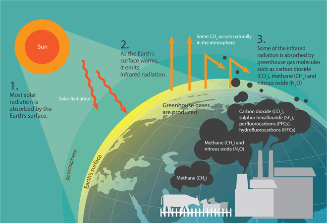

# Outreachy December 2022 contribution phase at Moja Global

___

## Task 0- Git & Github

---
A description of my interest in the project

>[Research data sources for carbon sequestration in forests](https://www.outreachy.org/outreachy-december-2022-internship-round/communities/moja-global/#research-data-sources-for-carbon-sequestration-in-)

***

### Requirements
The description should:- 
- [x] not contain more than 1000 words
- [x] describe interest in participating in the selected project [Why I picked this project](#Why-I-picked-this-project)
- [x] describe climate change impact on the environment  [Climate change](#Climate-change)
- [x] describe the impact of climate change and action on the globe [Impact of climate change on the global world](#Impact-of-climate-change-on-the-global-world)
- [x] how does climate change affect my local community(Nigeria)? [Climate change in nigeria](#Climate-change-in-nigeria)
- [x] What can be done to mitigate and adapt to climate change? etc. [Mitigating climate change](#Mitigating-climate-change)

### Table of contents

___

* [Why I picked this project](#Why-I-picked-this-project)
* [Climate change](#Climate-change)
* [Impact of climate change on the global world](#Impact-of-climate-change-on-the-global-world)
* [Actions](#Actions)
* [Climate change in nigeria](#Climate-change-in-nigeria)
* [Mitigating climate change](#Mitigating-climate-change)
* [Author](#author)
* [References](#References)

___

### Why I picked this project

I am excited to learn from and contribute to a project that solves an environmental problem which is to reduce climate change by reducing the amount of Co2 in the atmosphere through carbon sequestration as I have a passion to contribute towards the reduction in the amount of greenhouse gases in the atmosphere.

I am a geophysics student with data analytics and research skills that wants to contribute to the energy and environmental sector by working to look for energy sources that involve release of less greenhouse gas emissions while trying to reduce the amount of greenhouse gas in the atmosphere as this will help to reduce climate change.I believe this project is a good fit for my career goal because I am excited to hone my collaboration skills by contributing to this open source project and to have the chance to see some glimpses into my future career path in the energy and environmental sector.

[back to table of contents](#Table-of-contents)
___

### Climate change

<b>Climate change can be a natural process where temperature, rainfall, wind and other elements vary over decades or more</b>. In millions of years, our world has been warmer and colder than it is now. But today we are experiencing rapid warming from human activities, primarily due to burning fossil fuels that generate greenhouse gas emissions. Increasing greenhouse gas emissions from human activity act like a blanket wrapped around the earth, trapping the sun’s heat and raising temperatures.1

Climate change is the most significant challenge to achieving sustainable development, and it threatens to drag millions of people into grinding poverty.4<b>The consequences of climate change now include, among others, intense droughts, water scarcity, severe fires, rising sea levels, flooding, melting polar ice, catastrophic storms and declining biodiversity</b>.1

[back to table of contents](#Table-of-contents)
___

### Impact of climate change on the global world

Any small increase in global average temperature over an extended period can trigger a chain reaction of climatic change around the world.According to the [Intergovernmental Panel on Climate Change’s (IPCC) Working Group I Sixth Assessment Report](https://www.ipcc.ch/assessment-report/ar6/) (released on 6 August 2021), world average surface temperatures could increase by 1.0°C to 5.7°C by the end of this century. The rate of global mean sea level rise has accelerated and will continue throughout the 21st century, ranging from 0.32m to 1.01m.While a localised temperature change of 2°C or 3°C may not seem serious, it has grave consequences on a global scale because this temperature increase directly impacts the sustainability of water, food supplies, ecosystems, coastal stability and public health.The following diagram summarises the environmental impact created by an increase in the global average annual temperature2

[back to table of contents](#Table-of-contents)
___

### Actions 

To tackle climate change and its negative impacts, world leaders at the UN Climate Change Conference (COP21) in Paris reached a breakthrough on 12 December 2015: the historic Paris Agreement.The Agreement sets long-term goals to guide all nations:
<ul>
    <li>Substantially reduce global greenhouse gas emissions to limit the global temperature increase in this century to 2 degrees Celsius while pursuing efforts to limit the increase even further to 1.5 degrees.</li>
    <li>Review countries’ commitments every five years </li>
    <li> provide financing to developing countries to mitigate climate change, strengthen resilience and enhance abilities to adapt to climate impacts.</li></ul>

[back to table of contents](#Table-of-contents)
___

### Climate change in nigeria

Nigeria has a tropical climate with 2 seasons (wet and dry). The mean annual variability and trend of rainfall over Nigeria in the last six decades depicts several inter-annual fluctuations and responsible for extreme climate events such as droughts and floods in many parts of the country.
<ul>
    <li>Years ago, Nigeria experienced climate change disaster which happened in the Northeastern region which is now Borno and Yobe states the territory along the Southern part of lake Chad dried up.</li>
    <li>Due to logging and over dependence on firewood for cooking, a greater part of the Nigeria’s Guinea Savannah region has been stripped of its vegetation cover. </li>
    <li>Similarly, the forest around Oyo has been reduced to grassland.</li>
    <li>In late August 2012, Nigeria was hit by the worst flooding due to climate change ever experienced in 40 years. This affected 7 million people in communities across 33 states including kogi state. More than 2 million people out of the affected 7 million were driven from their homes by rising waters.</li>
<li>Nigeria experienced another flooding caused by heavy seasonal rains in 2013 which brought further misery to a population that was still recovering from the 2012 fatal floods</li>
    <li>According to statistics released in 2014 by National Emergency Management Agency (NEMA), about 5,000 houses and 60 homes were affected in a windstorm that occurred in four states in the south west region.</li></ul>
In Nigeria areas around the coastal regions are at risk of rising sea level. For example, the Niger Delta area is extremely vulnerable to flooding at a risk of rising sea level and a victim of extreme oil pollution.[^3]

[back to table ofcontents](#Table-of-contents)
___

### Mitigating climate change

Since the primary cause of climate change is due to amount of greenhouse gases in the atmosphere, there is need to reduce the amount of greenhouse gases and this can be done by:-
<ol>
    <li>Trapping greenhouse gases such as carbon making good use of them for other beneficial purposes by <b>Implementing climate-smart agriculture and nurture forest landscapes</b></li>
    <li> Put a price on carbon by creating an incentive to reduce polluting behaviors and to invest in cleaner energy choices and low-carbon innovation</li>
    <li> By ending fossil fuel subsidies, countries can reallocate their spending to where it is most needed and most effective, including proving targeted support for the poor.</li>
    <li> Careful planning of transportation and land use, and the establishment of energy efficiency standards, cities can  reduce damaging air pollution.</li>
    <li> Increase energy efficiency and use of renewable energy </li> </ol>
    
[back to table of contents](#Table-of-contents)
___

### Author

Hafsah Anibaba - hafsahoyin@yahoo.com

[back to table of contents](#Table-of-contents)

### References 

* [What is climate change](https://www.un.org/en/climatechange/what-is-climate-change)
* [Global impact of climate change](https://www.nccs.gov.sg/about-climate-change/global-impact-of-climate-change/)
* [Climate change in Nigeria](https://en.wikipedia.org/wiki/Climate_change_in_Nigeria)
* [Climate change as a challenge for sustainability](https://www.worldbank.org/en/news/speech/2014/01/15/climate-change-is-challenge-for-sustainable-development)

[back to table of contents](#Table-of-contents)
