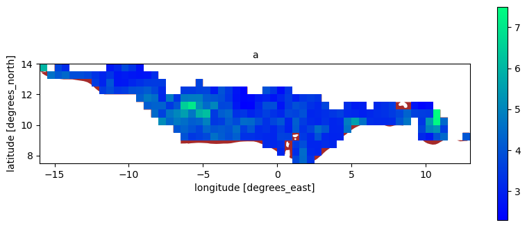
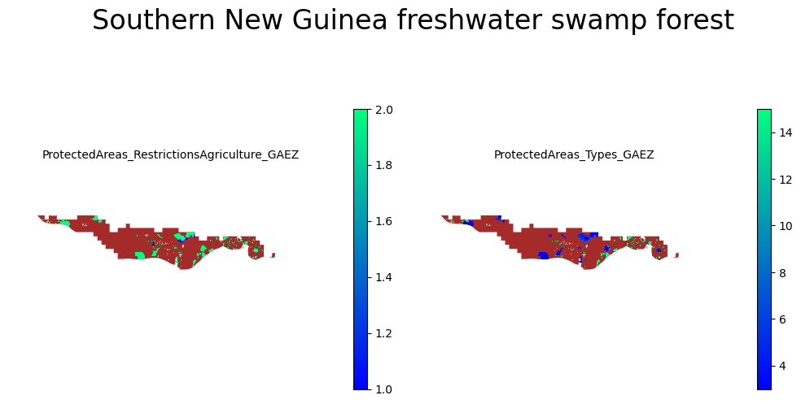
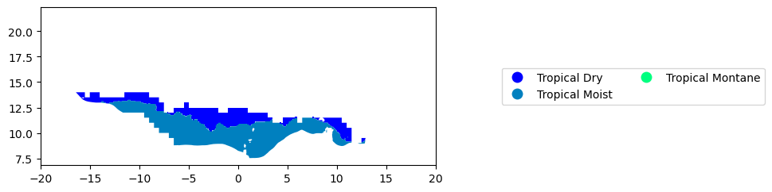
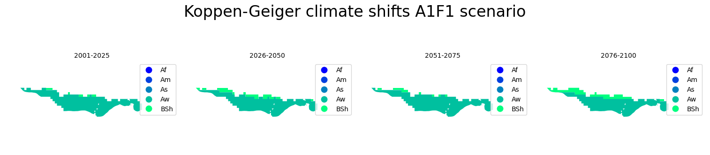

### Analysis on Southern New Guinea freshwater swamp forest

After I made global analysis on forests which i did  [here](https://nbviewer.org/github/Hafsah2020/Outreachy_Hafsah_Anibaba_2022/blob/main/global_forest_analysis.ipynb) and shared results of my analysis [here](Global_anlysis.md). I picked interest in Southern New Guinea freshwater swamp forest and analysed it [here](https://nbviewer.org/github/Hafsah2020/Outreachy_Hafsah_Anibaba_2022/blob/main/favourite_forest_analysis.ipynb)

### Table of contents

___

* [Administrative boundaries](#Administrative-boundaries)
* [Bioclimatic zones](#Bioclimatic-zones)
* [Climate](#Climate)
* [Soil](#Soil)
* [Reference](#Reference)

___

Southern New Guinea freshwater swamp forest is of the biome `Tropical and subtropical moist broadleaf forests`.

### Administrative boundaries

Southern New Guinea freshwater swamp forest is located in West Africa

<b> Location of the forest on the world map</b>

<b> Location of the forest in Africa </b>

The forest run through the following countries

<b> countries the forest covers </b>

### Bioclimatic zones

###### Agro-ecological zones

I plotted the agroecological zones of the forest here:

There are moist soils towards the south eastern part of the forest, Subhumid soils are distributed within the forst.

###### Carbon density

Most parts of the forestt has low carbon density except for two part in the central West and centarl East that has high carbon density

###### Dominant land cover and rainfed terrain suitabillity

The South-Eastern part of the forest has more land use than other parts 
Most of the forest part is not suitable for rainfed agriculture except the parts highlighted in green which is in the Western part and a tiny portion in the East

###### Soil nutrients and water scarcity

There is little variablity in the soil nutrients of the forest which has low nutrients in the part highlighted green in the East that has high nutrients
There is no variability in water scarcity of the forest which belongs to the economic water scarcity zones

###### Protected areas

The South-Eastern part of the forest has the most protected areas and mmost protected areas are for agriculture

###### Rooting conditions

There is less variability in rooting conditions of the forest

###### Biomes

The biome of the forest is `Tropical and subtropical moist broadleaf forests`

### Climate

###### climate zones

I plotted the climate zones of the forest here:

The climate towards the South of the forest is tropical moist and the the climatte towards the North is tropical dry

###### climate shifts

The five scenarios are as follows:

A1F1 (Global/Economic) - describes a future world of rapid economic growth, with a global population that peaks in the mid 2000's and declines afterwards it follows a "business as usual" fossil fuel intensive future.

A2 (Local/Economic) - follows a more conservative economic world, where economic growth is more limited to smaller regions of the world. Technological change is slower in this storyline, while high fertility rates result in a booming population.

B1 (Global/Environmental) - assumes the same population growth as the A1 storyline. It differs in that it has less of a material intense society, and focuses more on clean and efficient technologies. It takes emphasis on global solutions to economic, social and environmental sustainability, but with no additional climate incentives.

B2 (Local/Environmental) - focuses on a society that looks for local solutions to economic, social, and environmental sustainability. It is a world with continuously increasing global population in accordance with the UN prediction, with intermediate levels of economic development, and less rapid technological change compared to the B1 and A1 storylines. It focuses on local and regional solutions to environmental protection and social equity.[1](https://energyeducation.ca/encyclopedia/Emission_scenario)

<b> climate shifts from 1901 to 2000</b>

<b>predicted climate shifts from 2001 to 2100 - A1F1 scenario</b>
In this scenario it is still expected that it has a similar climate but it will still tend more towards hot semi-arid climate

<b>predicted climate shifts from 2001 to 2100 - A2 scenario</b>
In this scenario it is expected it will have more of hot semi-arid climate but still less compared to the A1F1 scenario.

<b>predicted climate shifts from 2001 to 2100 - B1 scenario</b>
In this scenario it is expected it will have less of hot semi-arid climate compared to the A1F1 scenario.

<b>predicted climate shifts from 2001 to 2100 - B2 scenario</b>
In this scenario it is expected it will have less of hot semi-arid climate compared to the A1F1 scenario.

### Soil

<b>The forest has Leptosol in its South-Western part, small water bodies in the south, Solonchak, Lixisol in the west,  </b>

### Author

Hafsah Anibaba - hafsahoyin@yahoo.com

### Reference

1. [https://energyeducation.ca/encyclopedia/Emission_scenario](https://energyeducation.ca/encyclopedia/Emission_scenario)
