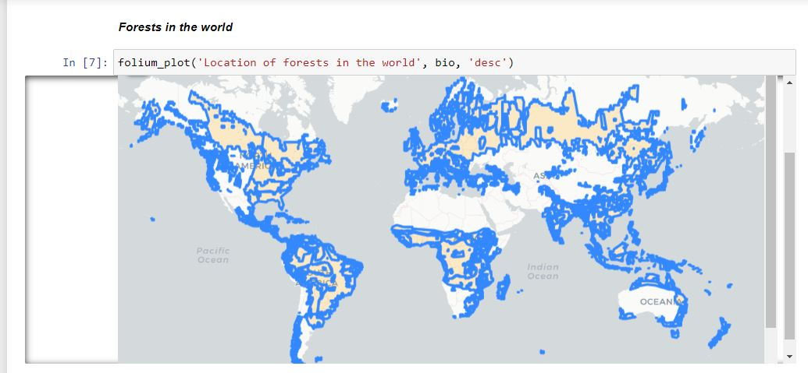
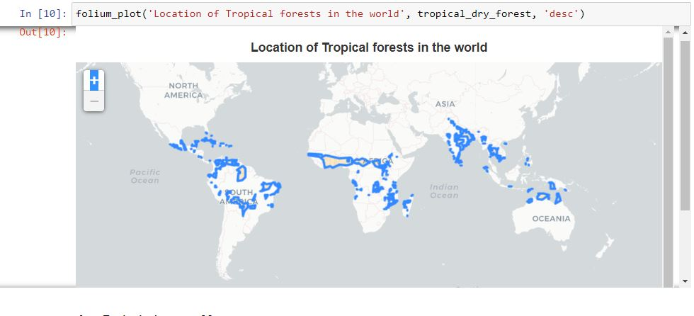
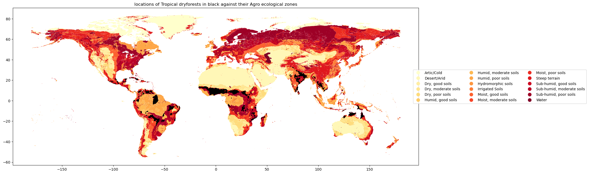
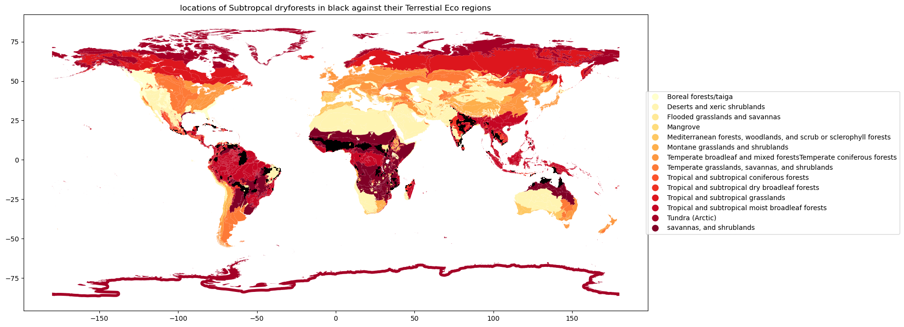
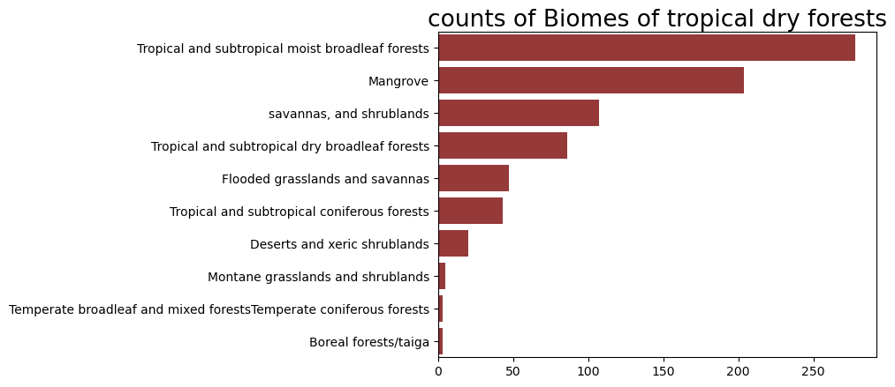
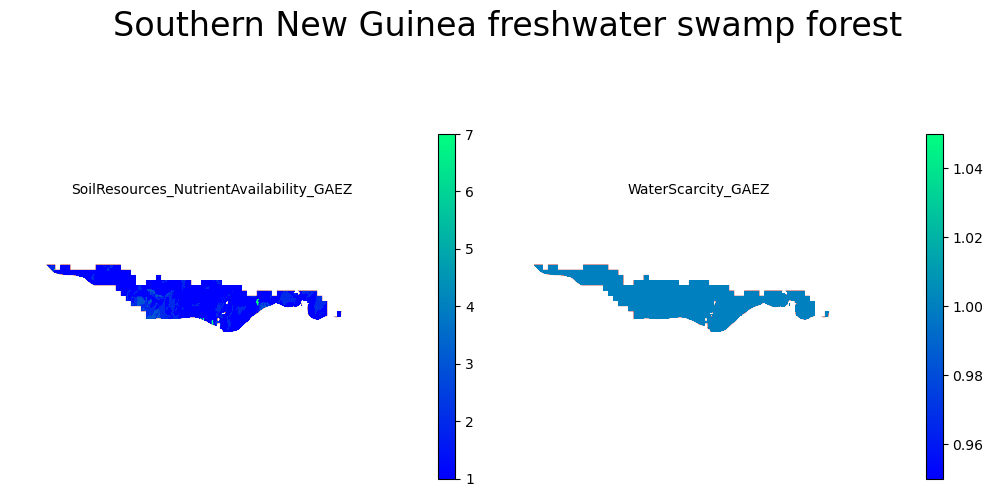
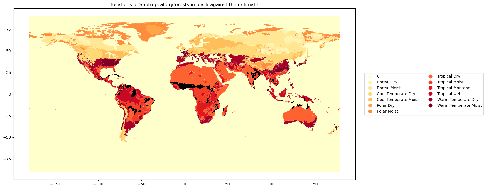
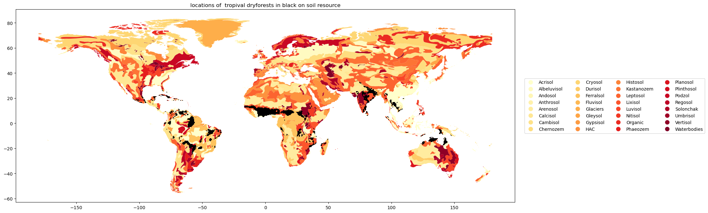

## Global analysis of forests 

The task is to pick a favourite forest, make analysis and report my findings which I have done [here](https://nbviewer.org/github/Hafsah2020/mentorship-outreachy/blob/moja-global-main/outreachy/Southern_New_Guinea_freshwater_swamp_forest_analysis/Global_analysis_of_all_forests_in_the_world.ipynb)

### Table of contents

___

* [Administrative boundaries](#Administrative-boundaries)
* [Bioclimatic zones](#Bioclimatic-zones)
* [Climate](#Climate)
* [Soil resources](#Soil-resources)

___

### Administrative boundaries

To see the avilable forests I plotted all forests from the data I got [here](https://datasets.mojaglobal.workers.dev/0:/Bioclimatic&EcologicalZones/HoldridgeLifeZones.json) and I have this

Then I picked interest in `tropical dry forests` and focused analysis on this type of forest
The locaton and boundaries of tropical dry forests is shown here:

### Bioclimatic zones

###### Agro-ecological zones

I plotted the forest against their agroecological zones here:

The forests are mostly found in the subhumid soils and moist soils agro-ecological zones

###### Biomes

I plotted the forest against their Biomes here:

The forests are mostly found in the Tropical and subtropical moist broadleafs, savannah and shrublands,

###### Water scarcity zones

I plotted the forest against water scarcity zones here:

The forests are located mostly in the economic water scarcity zones and alos in the physical water scarcity zones

### Climate
I plotted to see the climates of tropical dry forsts

As expected they are found in tropical dry forests

### Soil resources

I plotted to see the kind of soils in tropical dry forsts

The soil resources commonly found in tropical dry forests are Vertisol,  Lixisol

### Author

Hafsah Anibaba - hafsahoyin@yahoo.com